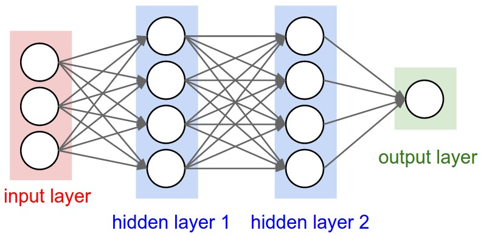

# Predicting Bike Sharing Data
#### First Neural Network

A neural network built from scratch to carry out a prediction problem on a real dataset to predict how many bikes a business would need according to the historical data so that it doesn't lose out money from potential riders by having too few bikes and also doesn't waste money on bikes that are just sitting around by having too many.

Open and view the Project using the `.zip` file provided or at my [Github Repository](https://github.com/madhur-taneja/Predicting-Bike-Sharing-Data).

The project is also hosted on [Github](https://madhur-taneja.github.io/Predicting-Bike-Sharing-Data/Your_first_neural_network).

## Table of Contents
- [Getting Started](#getting-started)
	- [Tools Required](#tools-required)
	- [Installation](#installation)
- [Running the App](#running-the-app)
- [Development](#development)
- [Stopping the App](#stopping-the-app)
- [Extras](#extras)
- [References](#references)

## Getting Started

The starter project can be downloaded from [here](https://github.com/udacity/deep-learning/tree/master/first-neural-network)

The project will be evaluated by a Udacity code reviewer according to the project [rubric](https://review.udacity.com/#!/rubrics/700/view)

The neural network is trained on the [UCI Machine Learning Dataset](https://archive.ics.uci.edu/ml/datasets/Bike+Sharing+Dataset)

This is how the neural network will look:



The network has two layers, a hidden layer and an output layer. The hidden layer will use the sigmoid function for activations. The output layer has only one node and is used for the regression, the output of the node is the same as the input of the node.

### Tools Required

You would require the following tools to develop and run the project:

* [Pip](https://pip.pypa.io/en/stable/installing/)
* [Python](https://www.python.org/downloads/)
* [Anaconda](https://www.anaconda.com/products/individual) or [Miniconda](https://docs.conda.io/en/latest/miniconda.html)

### Installation

#### With Conda
* Start by installing python and anaconda
* Create a new conda environment
	```
	conda create --name dlnd python=3
	```
* Enter your new environment:
	* Mac/Linux: `>> source activate dlnd`
	* Windows: `>> conda activate dlnd`
* Install `numpy`, `matplotlib`, `pandas`, and `jupyter notebook` using the following command:

	```
	conda install numpy matplotlib pandas jupyter notebook
	```

#### Without Conda
If you don't have Conda, a `requirements.txt` file is provided to install all of the necessary packages using pip.

Open CLI in the root directory of the project. Run the following command:
```
python -m venv --system-site-packages .\venv # Creates a virtual environment
.\venv\Scripts\activate                      # Activates the environment
pip install -r requirements.txt              # Installs the required packages
pip list                                     # Show packages installed within the virtual environment
```
	
## Running the App

To run the project:

1. Activate the Conda or Python virtual environment as mentioned above

2. Start the Jupyter Notebook by running the following command:
	```
	jupyter notebook
	```
	Open your browser and visit localhost:8888 (or the port indicated in the terminal), and you should see all of the contents of the project in `Your_first_neural_network.ipynb` notebook

3. After completing the development, press the `play`  :arrow_forward:  icon to start the execution of cells. The output will be visible right below each respective cells.

## Development

Follow the instructions in the notebook; they will lead you through the project. You'll ultimately be editing the `my_answers.py` python file, whose components are imported into the notebook at various places

## Stopping the App

Once you're done with the app, stop it gracefully using the following command:

1. Select `File -> Close and Halt` inside jupyter notebook 
2. Press `Ctrl+c` in the cli

#### With Conda
```
>> conda deactivate dlnd           # Deactivate the environment
>> conda remove --name dlnd --all  # Delete the environment
```
#### Without Conda
```
>> deactivate                      # Deactivate the environment
```

## Extras

* Before submitting your solution to a reviewer, you are required to submit your project to `Udacity's Project Assistant`, which will provide some initial feedback.
* The setup for the project assistant is simple. If you have not installed the client tool from a different Nanodegree program already, then you may do so with the command: `pip install udacity-pa`
* To submit your code to the project assistant, run `udacity submit` from within the top-level directory of the project. You will be prompted for a username and password.
* This process will create a zipfile in your top-level directory named `first_neural_network-result-.zip`, where there will be a number between `result-` and 	`.zip`. This is the file that you should submit to the Udacity reviews system.

## References

* [Gradient](https://www.khanacademy.org/math/multivariable-calculus/multivariable-derivatives/gradient-and-directional-derivatives/v/gradient) by Khan Academy
* [Multivariable calculus lessons](https://www.khanacademy.org/math/multivariable-calculus) by Khan Academy
* [Backpropogation Lecture](https://www.youtube.com/watch?v=59Hbtz7XgjM) from Andrej Karpathy
