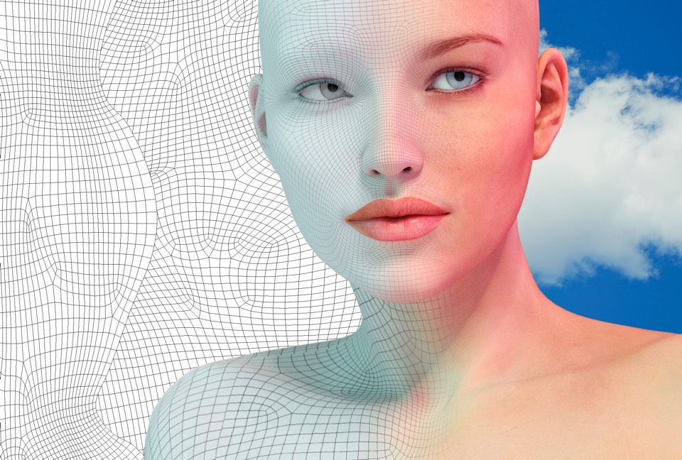

# Generate Faces

A Generative Adversarial Network (GAN) to generate new images of faces from the MNIST and CelebA Dataset

Open and view the Project using the `.zip` file provided or at my [Github Repository](https://github.com/madhur-taneja/Generate-Faces)

The project has been hosted on [Github](https://madhur-taneja.github.io/Generate-Faces/dlnd_face_generation.html)

## Table of Contents
- [Getting Started](#getting-started)
	- [Tools Required](#tools-required)
	- [Installation](#installation)
        - [Setting up Locally](#setting-up-locally)
        - [Setting up Dataset](#setting-up-dataset)
        - [Setting up FloydHub](setting-up-floydHub)
- [Running the App](#running-the-app)
- [Development](#development)
- [Stopping the App](#stopping-the-app)
- [Running the Tests](#running-the-tests)
- [Acknowledgments](#acknowledgments)
- [References](#references)

## Getting Started

The starter project can be downloaded from [here](https://github.com/madhur-taneja/deep-learning/tree/master/face_generation)

The project will be evaluated by a Udacity code reviewer according to the project [rubric](https://review.udacity.com/#!/rubrics/891/view)

### Tools Required

You would require the following tools to develop and run the project:

#### Locally on your System

* [Pip](https://pip.pypa.io/en/stable/installing/)
* [Python](https://www.python.org/downloads/)
* [Anaconda](https://www.anaconda.com/products/individual) or [Miniconda](https://docs.conda.io/en/latest/miniconda.html)

OR

#### Virtually on Cloud GPU

* Account on one of the following cloud services:
    * [AWS](https://aws.amazon.com/console/)
    * [GCP](https://cloud.google.com/)
    * [Azure](https://azure.microsoft.com/en-in/)
    * [FloydHub](https://www.floydhub.com/)
* Compute Service Instance (like EC2 in case of AWS)

### Installation

This project trains on a complex dataset and requires a powerful GPU. For those reasons, its advised to run the project on FloydHub. You can choose to use AWS or GCP compute services.

You can also use online Python executors like [Google Colab](https://colab.research.google.com/) or [Jupyter Lab](https://mybinder.org/v2/gh/jupyterlab/jupyterlab-demo/try.jupyter.org) by uploading your `ipynb`s there to view them

#### Setting up Locally

In case you want to setup the project locally to view the notebook using Conda or just a Python virtual environment, follow the Installation steps mentioned in my other repo [here](https://github.com/madhur-taneja/Generate-TV-Scripts#installation) and setup the project by only changing conda env name

NOTE: Name of the requirement file is `floyd_requirements.txt` for this project. Alter the command accordingly

#### Setting up Dataset

The project's DCGAN is trained on the [CelebFaces Attributes Dataset](http://mmlab.ie.cuhk.edu.hk/projects/CelebA.html) and the [MNIST Dataset](http://yann.lecun.com/exdb/mnist/). Download them from the links provided above.

#### Setting up FloydHub

1. Create an account on [FloydHub](https://www.floydhub.com/). Don't forget to confirm your email. You will automatically receive 100 free GPU hours. 

2. Install the `floyd` command on your computer:

        pip install -U floyd-cli

    Do this even if you already installed `floyd-cli` before, just to make sure you have the most recent version (Its pace of development is fast!).

3. Associate the command with your Floyd account:

        floyd login

    (A page with authentication token will open; you will need to copy the token into your terminal)

4. Enter the folder for the face generation project:

        cd face-generation

5. Initiate a Floyd project:

        floyd init dlnd_face_generation_classification

6. Run the project:

        floyd run --gpu --env tensorflow --mode jupyter --data R5KrjnANiKVhLWAkpXhNBe

    It will be run on a machine with GPU (`--gpu`), using a Tenserflow environment (`--env tensorflow`), as a Jupyter notebook (`--mode jupyter`), with Floyd's built-in cifar-10 dataset  available (`--data diSgciLH4WA7HpcHNasP9j`).

7. Wait for the Jupyter notebook to become available and then access the URL displayed in the terminal (described as "path to jupyter notebook"). You will see the notebook.

8. Remember to explicitly stop the experiment when you are not using the notebook. As long as it runs (even in the background) it will cost GPU hours. You can stop an experiment in the ["Experiments" section](https://www.floydhub.com/experiments) or using the `floyd stop` command:

        floyd stop ID

    (where ID is the "RUN ID" displayed in the terminal when you run the project; if you lost it you can also find it in the ["Experiments" section](https://www.floydhub.com/experiments))

## Running the App

In case you're setting up the project locally, follow the steps mentioned in my other repo [here](https://github.com/madhur-taneja/Generate-TV-Scripts#running-the-app) to run the app

## Development

The following steps were performed to complete the project:

1. Unzip, load & explore the data.
2. Batch the data, transform and create a dataloader. Also define a function that can be used to scale the values to a differnt range if required.
3. Define the Discriminator & Generative Adversarial Networks with foreward pass, back-propagation functions, loss functions and optimizers for each network to be used while training and testing.
4. Define the initial weights, set hyper-parameters and define the training and testing functions to be finally called to train/evaluate the model.
5. Visualise the training loss and finally print out the new images generated by the model.

Follow the instructions in the notebook; they will lead you through the project. You'll be editing the `dlnd_face_generation.ipynb` file.

## Stopping the App

In case you're setting up the project locally, follow the steps mentioned in my other repo [here](https://github.com/madhur-taneja/Generate-TV-Scripts#stopping-the-app) to stop the app

## Running the Tests

In case you're setting up the project locally, add test cases to `problem_unittests.py` and to run it using the following command:

    python problem_unittests.py

## Acknowledgments
[Jonathon's Repo](https://github.com/JonathanKSullivan/Generate-Faces) for docs on floydhub.com

 This work is licensed under a <a rel="license" href="http://creativecommons.org/licenses/by-nc-nd/4.0/">Creative Commons Attribution-NonCommercial-NoDerivatives 4.0 International License</a>. Please refer to [Udacity Terms of Service](https://www.udacity.com/legal) for further information.

## References

* [Batch Normalization](https://arxiv.org/abs/1502.03167)
* A recent [Medium article](https://medium.com/coloredfeather/generating-human-faces-using-adversarial-network-960863bc1deb) that might help in understanding a similar project
