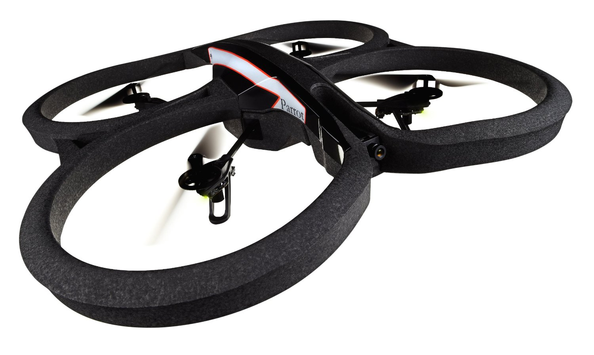

# Deep RL Quadcopter Controller

*Teach a Quadcopter How to Fly!*

An agent built using a reinforcement learning algorithm to train and fly a quadcopter. The project implements Deep Deterministic Policy Gradients (DDPG) algorithm.

Open and view the Project using the `.zip` file provided or at my [Github Repository](https://github.com/madhur-taneja/RL-Quadcopter-2)

The project is also hosted on [GitHub](https://madhur-taneja.github.io/RL-Quadcopter-2/Quadcopter_Project.html)

## Table of Contents
- [Getting Started](#getting-started)
	- [Tools Required](#tools-required)
	- [Installation](#installation)
- [Running the App](#running-the-app)
- [Development](#development)
- [Stopping the App](#stopping-the-app)
- [References](#references)

## Getting Started

The starter project can be downloaded from [here](https://github.com/udacity/RL-Quadcopter-2)

The project will be evaluated by a Udacity code reviewer according to the project [rubric](https://review.udacity.com/#!/rubrics/1189/view)



### Tools Required

You would require the following tools to develop and run the project:

* [Pip](https://pip.pypa.io/en/stable/installing/)
* [Python](https://www.python.org/downloads/)
* [Anaconda](https://www.anaconda.com/products/individual) or [Miniconda](https://docs.conda.io/en/latest/miniconda.html)

### Installation

1. Clone the repository and navigate to the downloaded folder.

```
git clone https://github.com/udacity/RL-Quadcopter-2.git
cd RL-Quadcopter-2
```

2. Create and activate a new environment.

```
conda create -n quadcop python=3.6 matplotlib numpy pandas
source activate quadcop
```

3. Create an [IPython kernel](http://ipython.readthedocs.io/en/stable/install/kernel_install.html) for the `quadcop` environment. 
```
python -m ipykernel install --user --name quadcop --display-name "quadcop"
```

4. Open the notebook.
```
jupyter notebook Quadcopter_Project.ipynb
```

5. Before running code, change the kernel to match the `quadcop` environment by using the drop-down menu (**Kernel > Change kernel > quadcop**). Then, follow the instructions in the notebook.

6. You will likely need to install more pip packages to complete this project.  Please curate the list of packages needed to run your project in the `requirements.txt` file in the repository.


## Running the App

To run the project:
1. Activate the Conda or Python virtual environment, and then start the jupyter notebook as mentioned above. Open your browser and visit localhost:8888 (or the port indicated in the terminal), and you should see all of the contents of the project in `Quadcopter_Project.ipynb` notebook
2. After completing the development, press the `play`  :arrow_forward:  icon to start the execution of cells. The output will be visible right below each respective cells.

## Development

The notebook contains the following functions and configurations:

1. `Replay Buffer` to store and recall experience tuples
2. `DDPG: Actor (Policy) Model` for the copter which is meant to map states to actions. 
3. `loss` function using `action_gradients` and `action`
4. `DDPG: Critic (Value) Model` is meant to map (state, action) pairs to their Q-values
5. The final output of this model is the Q-value for any given (state, action) pair. However, we also need to compute the gradient of this Q-value with respect to the corresponding action vector, needed for training the actor model.
6. `DDPG: Agent` is build by putting together the actor and policy models. Note that we will need two copies of each model - one local and one target
7. `Noise Model` uses the `Ornstein–Uhlenbeck Noise` process

Follow the instructions in the notebook; they will lead you through the project. You'll be editing the `Quadcopter_Project.ipynb` file.

## Stopping the App

Once you're done with the app, stop it gracefully using the following command:

1. Select `File -> Close and Halt` inside jupyter notebook 
2. Press `Ctrl+c` in the cli
3. Deactivate conda environment using the following command:
    ```
    >> conda deactivate generate-scripts
    ```
4. Delete the environment if done with the project] 
    ```
    >> conda remove --name generate-scripts --all
    ```

## References

* [Continuous Control with Deep Reinforcement Learning](https://arxiv.org/pdf/1509.02971.pdf)