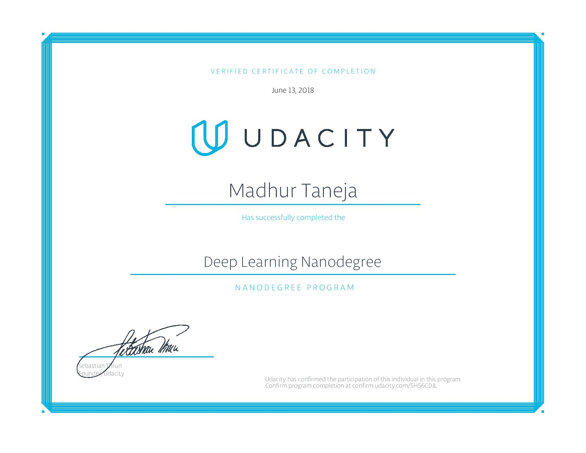

# Deep Learning Projects

[]()
[]()
[]()
[]()
[]()

This Repository contains my deep learning projects which were a part of the **Deep Learning Foundation Nanodegree Program (DLND)** by Udacity. The main concepts used were Neural Networks, Convolutional Neural Networks (CNNs), Recurrent Neural Network (RNNs), Generative Adversarial Network (GANs) and Deep Reinforcement Learning.

## Table of Contents

* [Repo](#repo)
* [Projects](#projects)
* [Tools](#tools)
* [Author](#author)
* [Certificate](#certificate)

## Repo

Inside the repo you'll find the following folders used to organize projects of DLND. Each folder contains the corresponding subfolders and files of that project along with a `README.md` for more info and description about that particular project. 

```
Deep-Learning Projects/
└──├── Project 1 (Predicting Bike Sharing Data)
   ├── Project 2 (Dog Breed Classifier)
   ├── Project 3 (Generate TV Scripts)
   ├── Project 4 (Generate Faces)
   ├── Project 5 (RL Quadcopter 2)
   ├── Nd-Grad-Cert.jpg
   └── ...
```

## Projects

The following is a list of current projects required to complete the Deep Learning Nanodegree along with the starter codes thats provided by Udacity:

1. [Predicting Bike Sharing Data](https://github.com/udacity/deep-learning/tree/master/first-neural-network)
2. [Dog Breed Classifier](https://github.com/udacity/dog-project)
3. [Generate TV Scripts](https://github.com/udacity/deep-learning/tree/master/tv-script-generation)
4. [Generate Faces](https://github.com/madhur-taneja/deep-learning/tree/master/face_generation)
5. [RL Quadcopter 2](https://github.com/udacity/RL-Quadcopter-2)

## Tools

The following is a list of tools used thoroughout the Deep Learning Nanodegree:

* [Anaconda](https://www.anaconda.com/products/individual) or [Miniconda](https://docs.conda.io/en/latest/miniconda.html)
* [Jupyter Notebook](https://jupyter.org/install)
* [Python](https://www.python.org/downloads/)

## Author

**Madhur Taneja**

* [LinkedIn](https://www.linkedin.com/in/madhur-taneja/)
* [GitHub](https://github.com/madhur-taneja)

## Certificate


